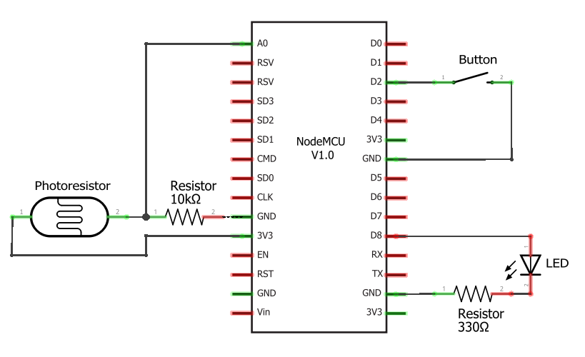

## **Intro**

An ESP8266 module by itself doesn't really interact with the physical world, but we can change that pretty easily by hooking it up to:

* An LED
* A button
* A light sensor

Note: If you are using a [Gizwits Witty](../Witty/info.html) ESP8266 module, then you can skip this entire section - that module integrates all of the external parts necessary for this tutorial.

## **Parts**

In addition to your ESP8266 module, you will need the following:

* Breadboard
  * Lets you easily connect all of the parts to each other
* LED
  * A very small, low-power light
* 330 Ohm Resistor
  * Connected to the LED to prevent it from exploding
* Photoresistor (aka CDS cell)
  * A resistor which changes its resistance based on how much light lands on its surface
* 10K (10,000) Ohm Resistor
  * Connected to the photoresistor to create a light sensor
* Normally-Open (NO) Push Button
  * Connects its two pins when pushed, otherwise leaves them disconnected

These parts are all super cheap, so it never hurts to have them laying around. If you don't already have these parts, I recommend buying a cheap breadboard and component starter kit like [this $13 kit from Amazon](https://www.amazon.com/Elegoo-EL-CK-002-Electronic-Breadboard-Potentiometer/dp/B01ERP6WL4)

## **ESP8266 Pins**
  
The naming of pins for ESP8266 can be a bit confusing - there is the name of the pin within Arduino, the name of the pin inside the ESP8266 itself, and the name of the pin as labeled on the module. For the purposes of our tutorial, here is the mapping between the Arduino pin name, the ESP8266 pin name, and a couple different module pin names

| Arduino Pin | ESP8266 Pin | [Witty Pin](https://blog.the-jedi.co.uk/2016/01/02/wifi-witty-esp12f-board/) | [NodeMCU Pin](https://github.com/nodemcu/nodemcu-devkit-v1.0) |  [Wemos D1 Mini Pin](http://www.wemos.cc/Products/d1_mini.html) | [Sparkfun ESP8266 Thing](https://learn.sparkfun.com/tutorials/esp8266-thing-development-board-hookup-guide/hardware-overview) | [Adafruit Huzzah](https://learn.adafruit.com/adafruit-huzzah-esp8266-breakout/pinouts) |
|:-----------:|:-----------:|:---------:|:-----------:|:------------------:|:----------------------:|:---------------:|
|      A0     |      A0     |    ADC    |      A0     |         A0         |           ADC          |        A        |
|      4      |    GPIO4    |   GPIO4   |      D2     |         D2         |            4           |        #4       |
|      15     |    GPIO15   |   GPIO15  |      D8     |         D8         |           15           |        15       |
{:.mbtablestyle}

## **Circuit Diagram**

This is the circuit diagram for the parts we're using in this tutorial. It assumes you're using a NodeMCU module and uses the NodeMCU module pin names. If you're using a different module, substitute pin names and locations as necessary. 

## **Breadboard Diagram**

If you don't know what to do with a circuit diagram, here's an equivalent breadboard diagram showing you how the different parts should be wired together. It also assumes you're using a NodeMCU module, so if you're using a different module, substitute pin names and locations as necessary. 

