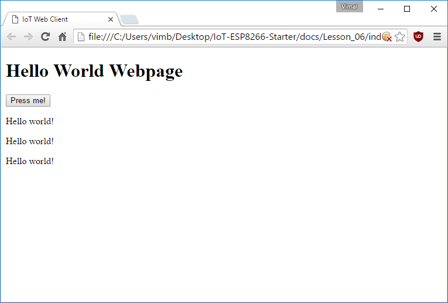

Now that we have a basic website in place, let's update it to subscribe to a MQTT topic and display incoming messages.


## Add an MQTT library

Javascript running within a web broswer is not capable of making a raw network connection to an MQTT broker over the standard MQTT protocol and port. Fortunately most MQTT brokers also offer a websockets-based interface which can be accessed using a javascript library like [Paho](https://eclipse.org/paho/clients/js/).

Let's add [Paho](https://eclipse.org/paho/clients/js/) to our website by adding a new ```<script>``` tag right above our app javascript ```<script>``` tag. To do that, replace the contents of the ```<body>``` tag in ```index.html``` with the following:

```
  <body>
    <h1>Hello World Webpage</h1>

    <!-- this is the secton wrapping our new button -->
    <div>
      <button onClick="myButtonWasClicked()">Press me!</button>
    </div>

    <!-- this is where new text will appear -->
    <div id="updateMe">
    </div>

    <!-- import jquery library -->
    <script src="https://code.jquery.com/jquery-3.1.0.min.js"></script>

    <!-- import paho MQTT library -->
    <script src="https://cdnjs.cloudflare.com/ajax/libs/paho-mqtt/1.0.1/mqttws31.min.js" type="text/javascript"></script>

    <!-- our javascript -->
    <script src="app.js"></script>
  </body>
```

## Display messages from an MQTT topic

### Generate a new unique client id

Since each client which connects to an MQTT broker should use a unique identifier and since each windw wher eyour web page is open counts as a unique "client", let's randomly generate a new MQTT client id by placing the following line at the top of our ```app.js```:

```
// Generate a new random MQTT client id on each page load
var MQTT_CLIENT_ID = "iot_web_"+Math.floor((1 + Math.random()) * 0x10000000000).toString(16);
```


### Connect to an MQTT Broker

Now that we have a new client id, let's connect to an MQTT broker using its websockets interface. For this tutorial, we're using the same broker address that we used in our ESP8266 module Arduino code, but with a different port and the addition of a "path" to where the websockets interface is exposed:

* address: iot.eclipse.org
* port: 80
* path: "/ws"

In your ```app.js``` immediately after you generate the client id, add the following:

```
// Create a MQTT client instance
var MQTT_CLIENT = new Paho.MQTT.Client("iot.eclipse.org", 80, "/ws", MQTT_CLIENT_ID);

// Tell the client instance to connect to the MQTT broker
MQTT_CLIENT.connect({ onSuccess: myClientConnected });
```

Note: Once the MQTT client successfully connects to the MQTT broker, it will attempt to run the function ```myClientConnected()```. This hasn't yet been defined, but in javascript it's okay reference a function and then define it later, as long as you don't try to *use* the reference until after it has been defined. This feature of the javascript language is known as [hoisting](http://www.w3schools.com/js/js_hoisting.asp)


### Create a client connected callback function

As noted above, we need to create a function named ```myClientConnected()``` which will be run after the MQTT client connection has been established. In this function we can do things like subscribe the topic that our ESP8266 module is publishing messages to. 

To do this, add the following code to the bottom of ```app.js```:

```
// This is the function which handles subscribing to topics after a connection is made
function myClientConnected() {
  MQTT_CLIENT.subscribe("<your_random_topic_root>/iot_tutorial/from_esp8266");
}
```

Note: You should remember to replace ```<your_random_topic_root>``` with the exact same value that you used in your Arduino code where you are publishing messages. 


### Create a message received callback function

Each time we receive a message from the MQTT broker, we want to take the payload and append it somewhere on our web page HTML.

Let's create a function named ```myMessageArrived``` and then tell the mqtt client to run that function each time a message arrives. 

To does this, add the following code to the bottom of ```app.js```:

```
// This is the function which handles received messages
function myMessageArrived(message) {
  // Get the payload
  var messageBody = message.payloadString;

  // Create a new HTML element wrapping the message payload
  var messageHTML = $("<p>"+messageBody+"</p>");

  // Insert it inside the ```id=updateMe``` element above everything else that is there 
  $("#updateMe").prepend(messageHTML);
};

// Tell MQTT_CLIENT to call myMessageArrived(message) each time a new message arrives
MQTT_CLIENT.onMessageArrived = myMessageArrived;
```

## Test your webpage

Before we proceed, make sure your index.html looks like [this](index.html) and your app.js looks like [this](app.js) except with the right values for the following substituted in:

* ```<your_random_topic_root>```

Also make sure your Arduino code looks like [this](MyIoTWidget.ino) except with the right values for the following substituted in:

* ```<your wifi access point name>```
* ```<your wifi access point password>```
* ```<your_random_device_client_id>```
* ```<your_random_topic_root>```


Close any open copies of your web page that you may have, and then double-click on ```index.html``` to open it up in a new browser window or tab. Wait a couple seconds, and you should start to see incoming message payloads sent by your ESP8266 module running your Arduino code: 



If you don't see any incoming messages, a couple things to double-check include:

* Make sure your ESP8266 module is plugged in and running, otherwise it can't publish messages
* Make sure the ESP8266 module has successfully connected to ```iot.eclipse.org``` port ```1883```
* Make sure your webpage has successfully connected to ```iot.eclipse.org``` port ```80``` path ```/ws```
* Make sure the topic name your ESP8266 is publishing to exactly matches the topic name your web page is subscribing to

